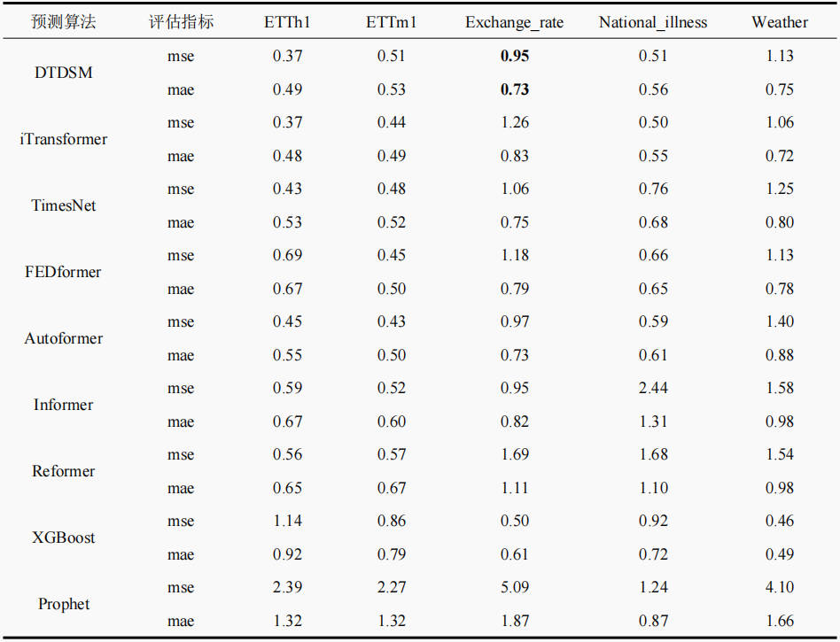
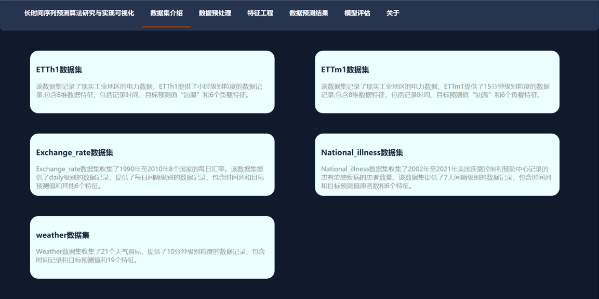
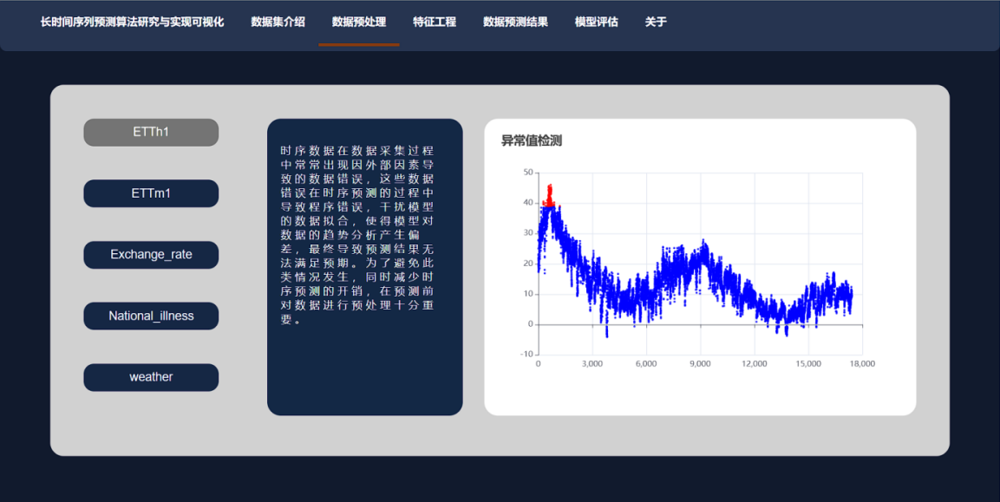
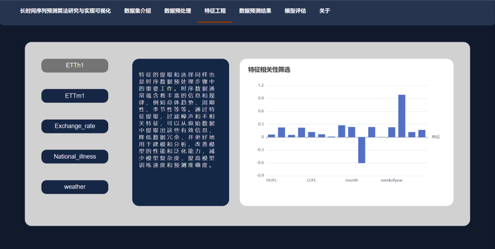
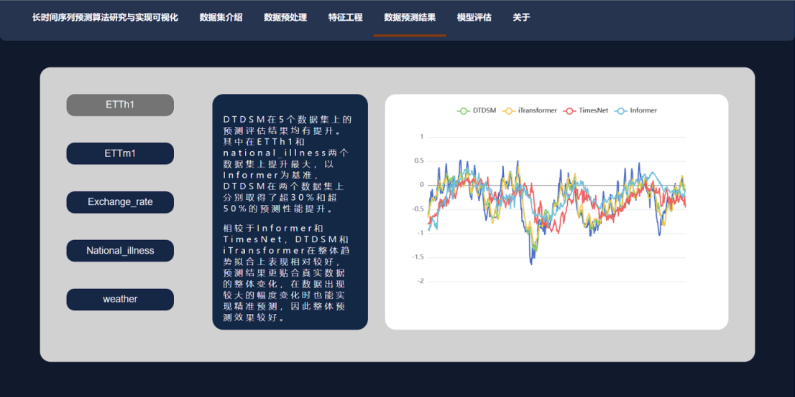
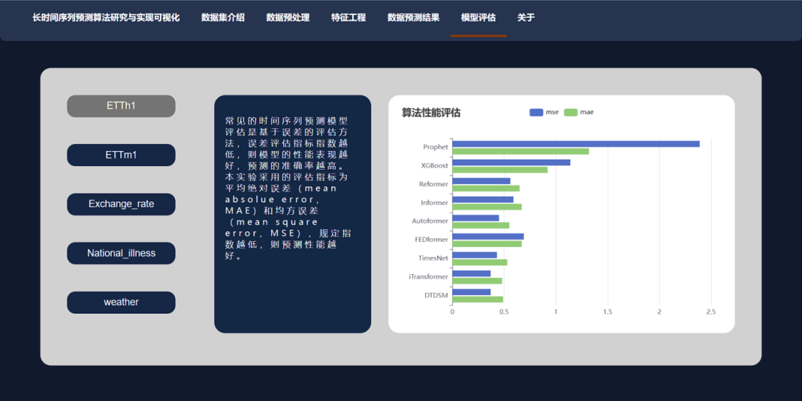

# DTDSM-长时间序列预测算法研究与实现
### 本科生毕业设计

****
项目结构
> Algro
> * data //数据预处理及特征提取
> * DTDSM //深度学习时序预测算法
> * Prophet
> * XGBoost

> web
> * backend //Flask后端
> * frontend //React前端

#
##### 对比实验结果

##### 前端展示

